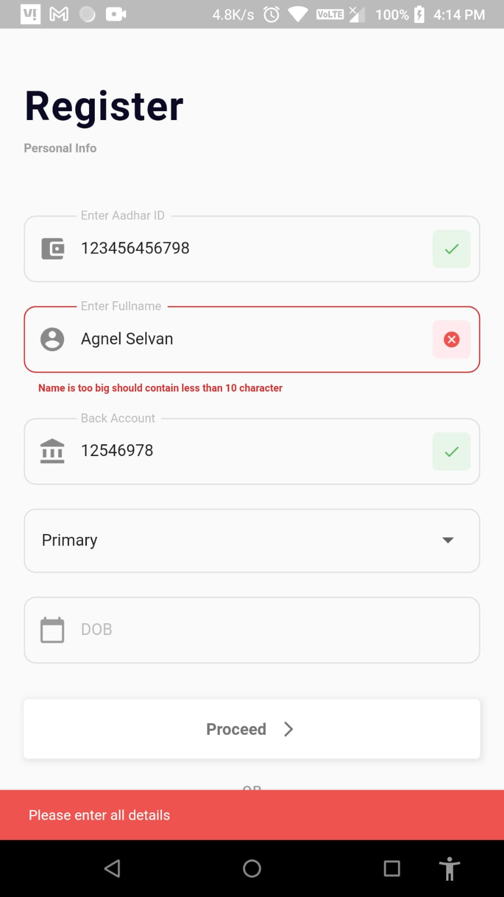
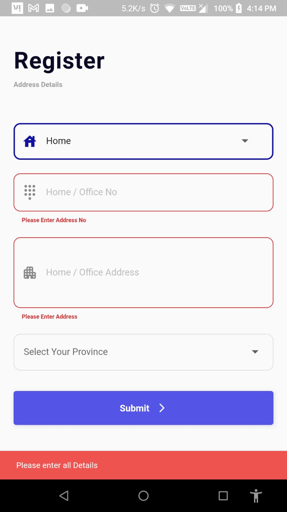
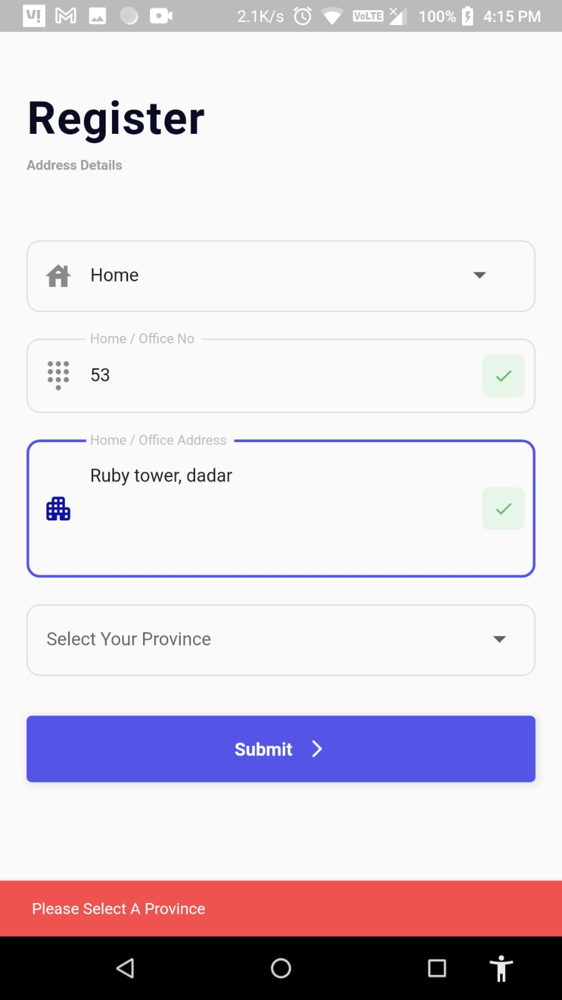
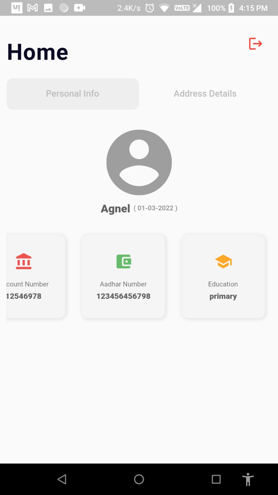
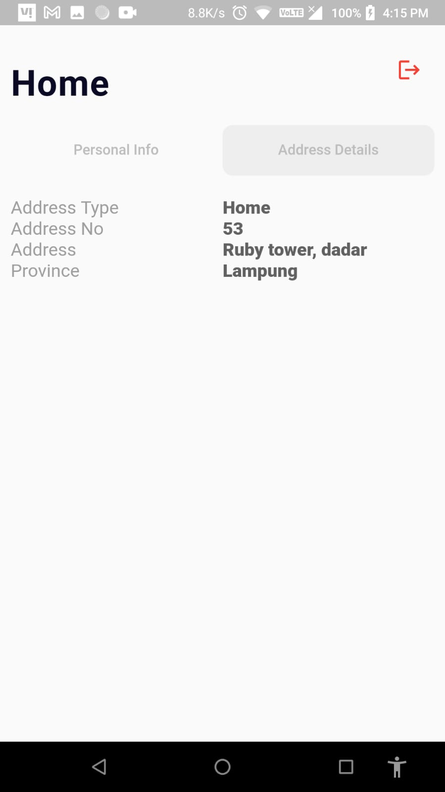
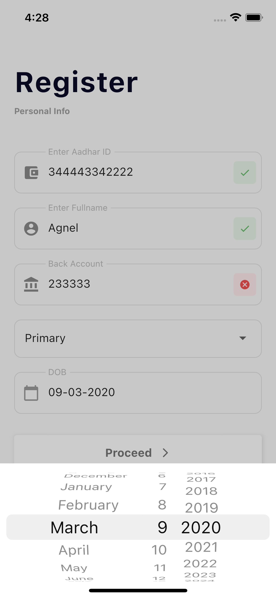
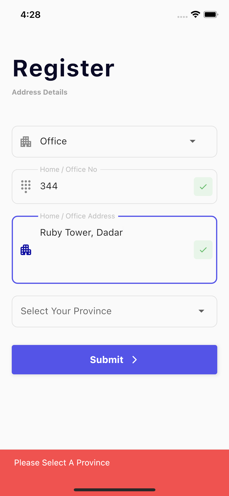
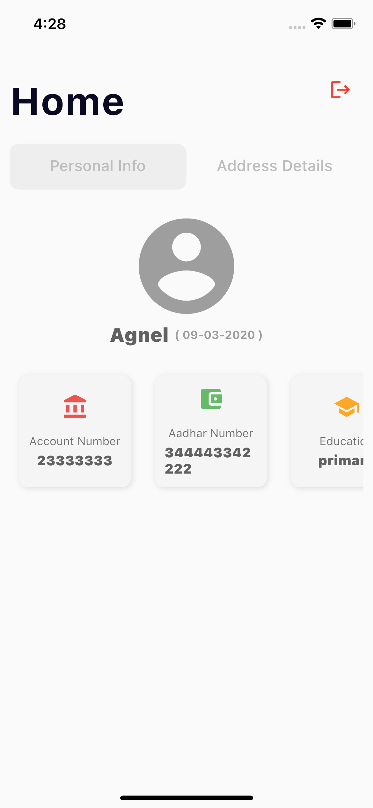
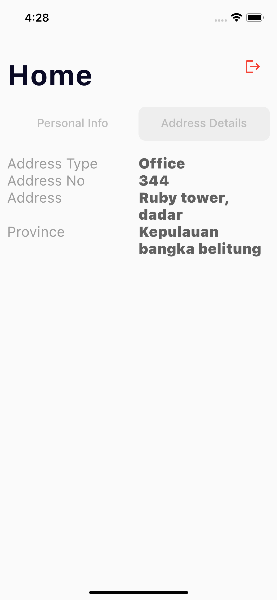

# Registration

A new Flutter Form Validation Project.

## Getting Started

### Download the project 

Run this both command in your project folder terminal
```dart
   flutter pub get 
```
```dart
   flutter pub run
```

## Outputs

##### Credits
Found the Inspirational Design on <a href="https://dribbble.com/shots/11583564-Mobile-Sign-Up-Form" target="_blank">Dribble</a> by <a href="https://dribbble.com/kubazelichowski" target="_blank">Kuba Zelichowski</a>

Android


<p align="center"></p>


<p align="center"></p>

iOS






